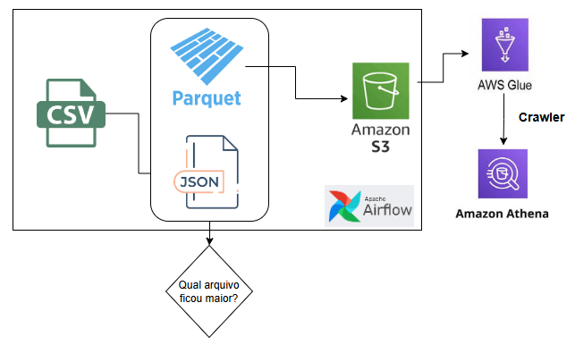
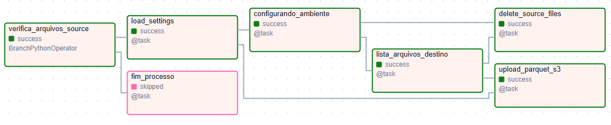
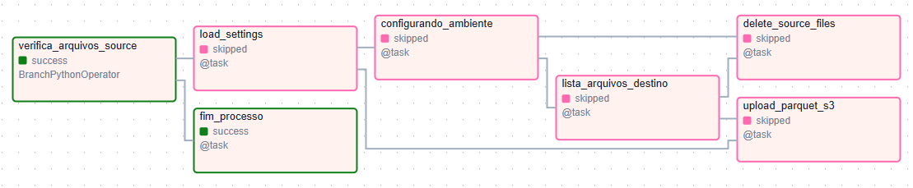
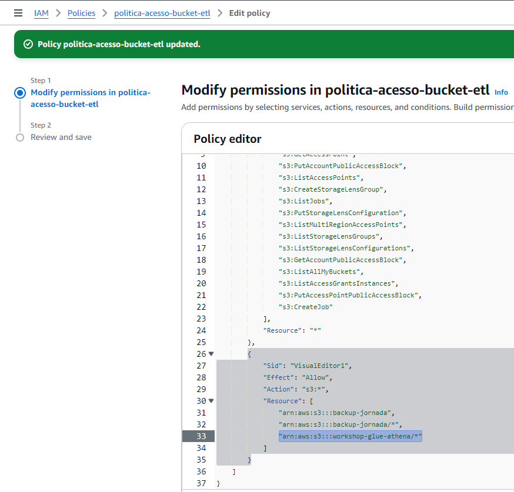
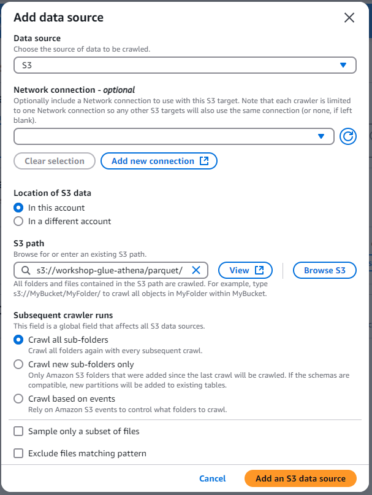
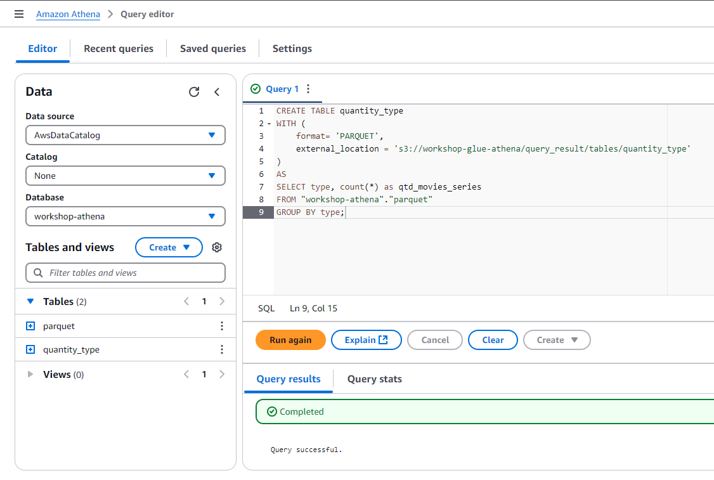

## Pipeline que será construída

<p align="center">
</img> 
</p>

<p align="justify">
Esse projeto tem um código Python, responsável por 4 principais etapas: 
</p>

- Checar se tem arquivos novos na pasta Source; 
- Transformar o arquivo .csv em .parquet e .json; 
  - Utilizando PyArrow para o Parquet; 
  - Pandas para o Json;
- Realizar o upload dos arquivos .parquet para a AWS S3; 
- Deletar os arquivos da pasta local, Source;

Isso tudo sendo orquestrado pelo Apache Airflow;

## Configurando o Ambiente

<h2>Baixando as bibliotecas necessárias</h2>
<ul>
    <li>Pandas: Para trabalhar com Data Frames;</li>
    <li>Boto3: Biblioteca de comunicação com a AWS;</li>
    <li>PyArrow: Biblioteca para trabalhar com arquivos Parquet, utilizando Python;</li>
    <li>python-dotenv: Para leitura das variaveis de ambiente;</li>
    <li>loguru: Biblioteca para criar o arquivo de logs;</li>
</ul>

### Airflow - Astro CLI

Para download e configurações do Astro CLI: 
<a href='https://www.astronomer.io/docs/astro/cli/install-cli/'>link</a>

```cmd
   astro dev init
   astro dev start
```

#### Fluxo das Dags
<p align="center">
  <a></a>
</p>

<p align="center">
  <a></a>
</p>

#### Execução das Dags
<p align="center">
  <a></a>
</p>

## Docker
### Dockerfile
<p>Baixa a imagem da Astronomer</p>

### docker-compose.override
<p>Cria o volume da pasta que contém:</p>
<ul>
    <li>Os arquivos que serão enviados para o S3;</li>
    <li>A pasta onde serão salvos os arquivos de log;</li>
    <li>O arquivo de variáveis de ambiente '.env';</li>
    <li>Código Python com as funções importadas na DAG;</li>
</ul>

## Alteração de Policies S3
Dentro das Policies do Bucket, ainda é mandatório alterar o JSON da política para aceitar que seja alterado qualquer tipo de arquivo.

<p align="center">
  <a></a>
</p>

## AWS Glue
Para casos em que não sabemos muito bem o esquema, a estrutura dos dados. Ele nos ajuda a descobrir isso e a catalogar.

1) Cria um Database; 
2) Cria um Crawler;

Configurando o Crawler, para ler todos os itens dentro da pasta selecionada do S3.
Isso é importante por que ele pode ler qualquer sub item, sendo pasta ou arquivo. 
<p align="center">
  <a></a>
</p>

## Consumindo os Dados - Athena 

### Lendo dados do arquivo Parquet enviado ao S3
<p align="center">
  <a></a>
</p>

### Criando uma tabela utilizando o Athena 
<p align="center">
  <a></a>
</p>

## Como rodar o código?

<p>Necessário ter:</p>
<ul>
    <li>O Docker instalado no computador. (<a href="https://www.docker.com/products/docker-desktop/">baixe_aqui</a>);</li>
    <li>O Astro CLI instalado no computador. (<a href="https://www.astronomer.io/docs/astro/cli/install-cli/">baixe_aqui</a>);</li>
    <li>Criar um bucket S3 na AWS e escrever um arquivo '.env' dentro da pasta "src" do projeto, com as variáveis necessárias;</li>
    <li>Dentro da pasta "src/data/source/" colocar os arquivos de interesse à serem transformados para '.parquet' e armazenados no Bucket S3;</li>
</ul>

### Comandos Astro CLI:

<p>Iniciar o projeto sem nenhuma modificação</p>

```cmd
   astro dev start
```

<p>Caso queira adicionar, deletar ou transformar alguma função do arquivo 'parquet_s3.py'</p>

```    
   astro dev restart  
```