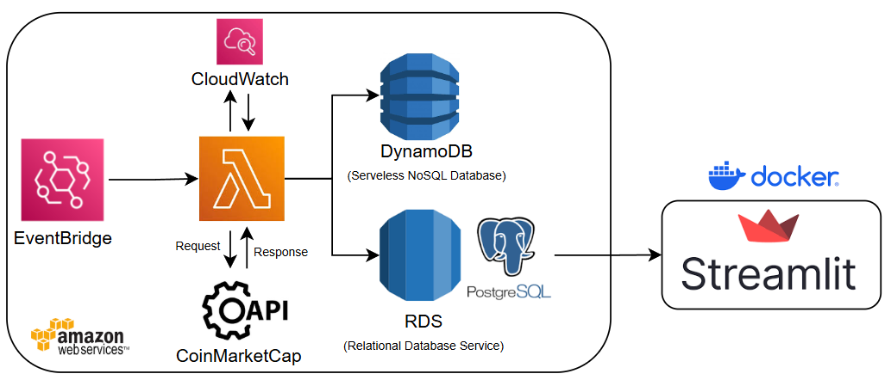
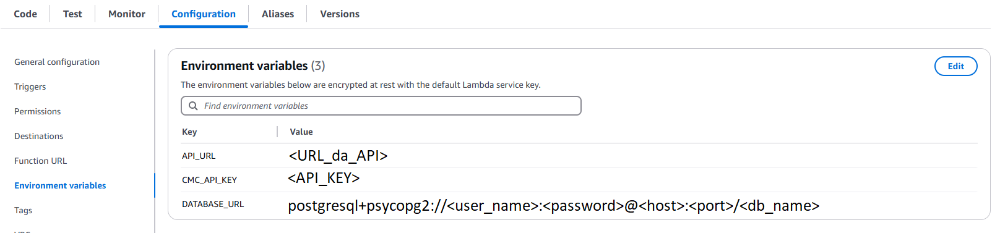
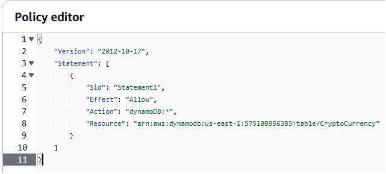
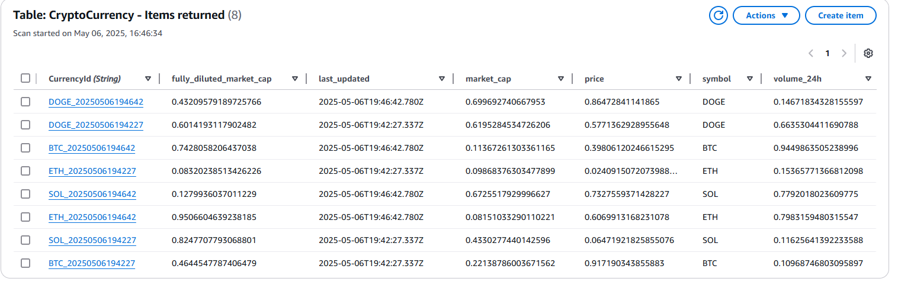
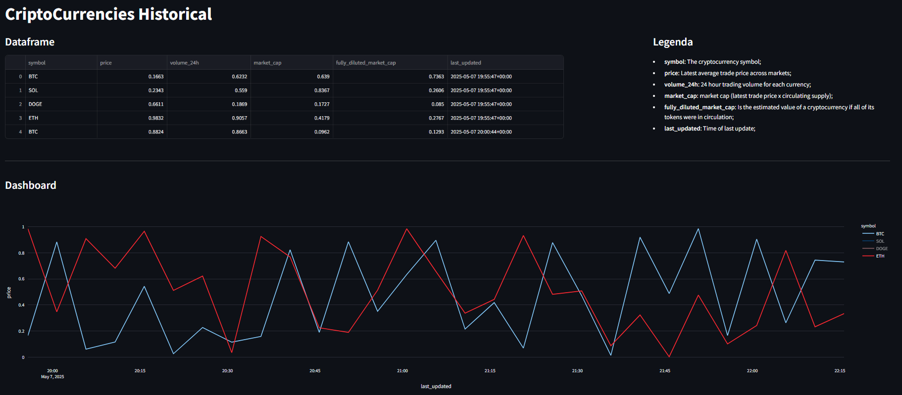
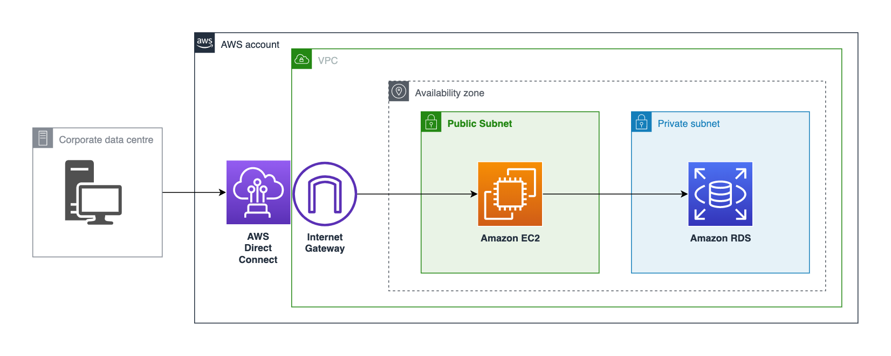

## Arquitetura do projeto 

</img>

## Passo a Passo de como realizei o meu projeto

1. Criei um Lamba Function;
2. Testei o meu código, porém deu erro na execução por não ter instalado as bibliotecas necessárias para o projeto;
3. Instalei as bibliotecas localmente, zipei e dentro do Lambda Layer realizei o upload;
4. Criei um "Environment Variables" para colar a URL, API_KEY e DATABASE_URL;
5. Criei o DynamoDB e o RDS Postgres para salvar os meus dados coletados da API;
6. Dentro do IAM do Lambda habilitei uma "policy" para realizar o "writting" (load) dos meus dados em cada um dos bancos; 

## Onde estão os códigos utilizados no Lambda Functions?
Eles estão na pasta "./src" um para a comunição com o PostgreSQL RDS e outro com o DynamoDB.

## Como adicionar bibliotecas na Layer do Lambda?

No computador local criar uma pasta "python" e baixar as bibliotecas necessárias, depois basta zipar e pronto!
Realizei isso em duas etapas, criando 2 layers no Lambda.

### Bibliotecas Request e SQLAlchemy
```bash:
pip3 install requests sqlalchemy -t .
```

### Instalando o psycopg2-binary para que seja possível a comunicação com o PostgreSQL
```bash:
docker run --rm -v "$PWD":/var/task public.ecr.aws/sam/build-python3.12:latest \
    /bin/sh -c "pip install -r requirements.txt -t python/lib/python3.12/site-packages/"
```

## Enviroment Variables 
</img>

## Exemplo da policy utilizada: 

Dentro do Lambda: Configuration -> Permissions -> Role Name -> Add Permissions -> Create Inline Policy -> JSON

</img>

## Dados Salvos no DynamoDB: 
</img>

## Comandos para rodar a imagem Docker do Dashboard 
Como criei um "docker-compose", basta executar o seguinte comando: 
```bash:
docker-compose up -d
```

## Visualizando os dados salvos no RDS

Coletei dados sobre as 4 crypto moedas [BTC, SOL, DOGE, ETH], utilizando a API, com o EventBridge rodando a cada 5minutos.
No gráfico abaixo filtrei 2 cryptos [BTC, ETH], para deixar mais visivel.

</img>

## Como próximos passos - Bastian Host

Poderia deixar tudo em produção, bastava subir a imagem Docker para um EC2. 

1) Subir a pasta do Dashboard para um repositório a parte; 
2) Através de uma comunição SSH com o EC2, poderia clonar o repo; 
3) Executar o comando para rodar a imagem Docker;

</img>