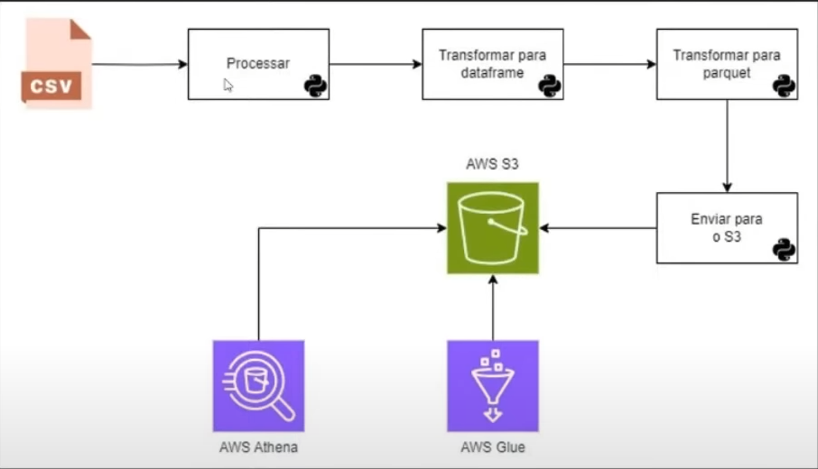

## Pipeline que será construído

</img> 

## Configurando o Ambiente

<h2>Baixando as bibliotecas necessárias</h2>
<ul>
    <li>Pandas: Para trabalhar com Data Frames;</li>
    <li>Boto3: Biblioteca de comunicação com a AWS;</li>
    <li>PyArrow: Biblioteca para trabalhar com arquivos Parquet, utilizando Python;</li>
    <li>python-dotenv: Para leitura das variaveis de ambiente;</li>
</ul>