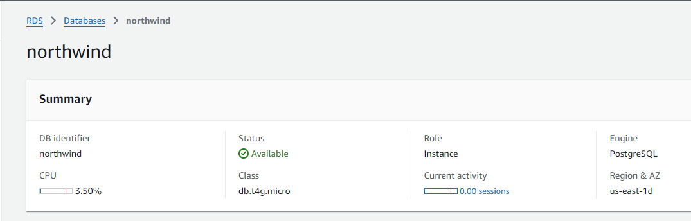

link de referência Medium: <a href="https://medium.com/@pahlavan.maryam/streamlining-your-data-workflow-installing-dbt-postgres-with-docker-compose-and-makefile-bf60a2cc9390">link_medium</a>

# Repositório Clonado

Clique aqui para ir para o repositório do Luciano, conteúdo do DBT: 

# Boas práticas DBT-Core
Documentação do DBT-Core
<a href="https://docs.getdbt.com/best-practices/how-we-structure/2-staging">best-practices</a>


# Passo a Passo para rodar o DBT

1) Criar um Banco de Dados na AWS [RDS], outra Cloud ou até mesmo local. 
</img>

2) Configurar o Banco de Dados com os Schemas das tabelas e os Dados. 
   Nesse caso, foi utilizado o "northwind.sql" como padrão de configuração do Banco.

3) Instalar o DBT: 
``` bash: 
poetry add dbt-postgres
```

4) Inicializar o DBT: 
``` bash: 
poetry shell
dbt init
```

5) Após setar as configurações: 
``` bash: 
dbt debug 
``` 

# DBT Seeds

É possível: 
   -  criar tabela;
   -  inserir dados;
   
<p>Basta colocar dentro da pasta Seeds do projeto DBT, um arquivo para atualizar a tabela do Banco de Dados. No exemplo foi utilizado um arquivo .csv para criar a linha do "Rio de Janeiro".</p>

``` bash: 
dbt seed
``` 

# DBT Models

Tudo que estiver na pasta models no final vai virar Tabela ou View.

Sempre que quiser rodar as mudanças da pasta do projeto do DBT
``` bash: 
dbt run
```

## RAW:

✅ Subdiretorios baseado na fonte dos dados.

Criar uma pasta com o nome da fonte dos dados e escrever um arquivo .sql
``` sql: 
select * 
from nova_tabela -- Arquivo apontando para o "Seed"
```

## Staging:
✅ Renomear
✅ Tipagem de dados
✅ Calculos simples
✅ Categorização

Criar uma pasta com o nome da fonte dos dados e escrever um arquivo .sql
``` sql: 
with renamed as (
    select 
        category_id as id,
        category_name as name, 
        description,
        picture, 
        update_at
    from 
        {{ref('raw_crm__nova_tabela')}} -- Arquivo apontando para a "Raw"
)

select * from renamed
```

## Intermediate:

✅ Subdiretorios baseado nos grupos de negócio

❌ Não recomendado para usuários finais

✅ Isolar operações complexas

Criar uma pasta com o nome da área de negócio e escrever um arquivo .sql
``` sql: 
with int_aggregate_by_category_id as (
    select
        id, 
        count(*)
    from 
        {{ref("stg_crm__nova_tabela")}} -- Arquivo apontando para a "Staging"
    group by 
        id
)

select * from int_aggregate_by_category_id
```

## Mart:
✅ Agrupar por departamento ou área de interesse

✅ Nomear por entidade 

❌ Construa o mesmo conceito de forma diferente para equipes diferentes. "finance_orders" and "marketing_orders" são consideradas tipicamente um anti-padrão.

❌ Muitos joins em um Data Mart.

Criar uma pasta com o arquivo .sql que contém os dados que serão utilizados pelo usuário final.
``` sql: 
with vendas as (
    select 
        * 
    from 
        {{ ref('int_aggregate_by_category_id')}} -- Arquivo apontando para a "intermediate"
)

select * from vendas
```

# Macros

É possível utilização de Macros para auxiliar no update, criação de tabelas. Auxiliando no uso de "unique_id", garantir que o schema não seja alterado ou que seja apenas alterado com colunas novas, etc.