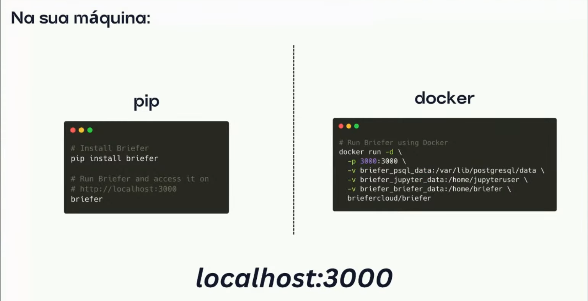
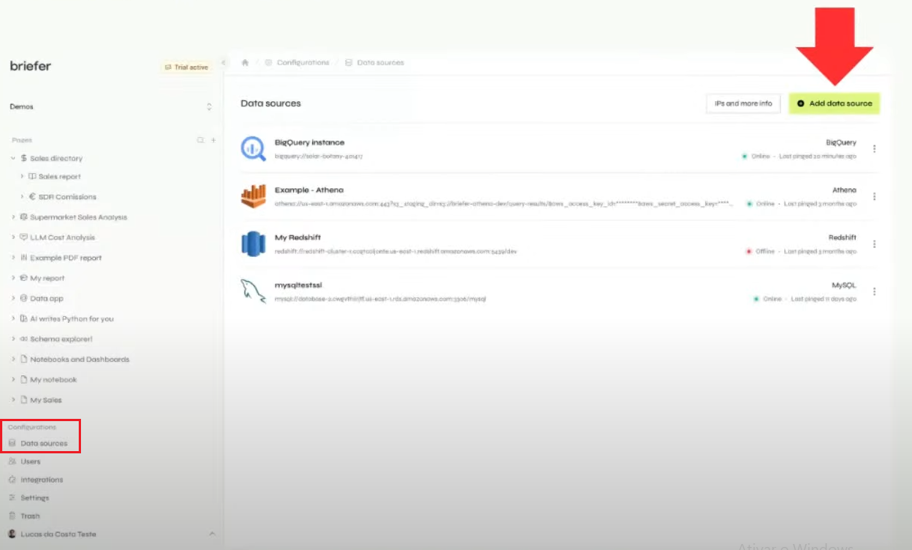
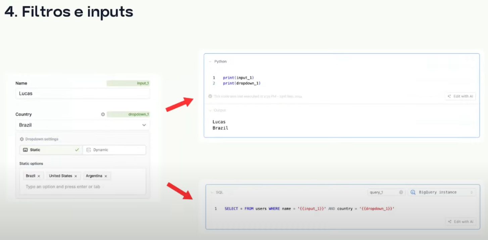
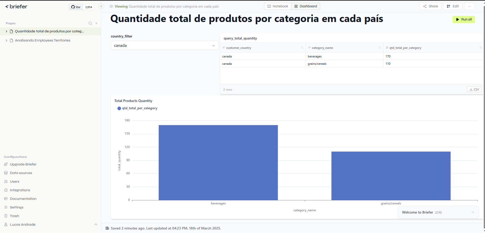
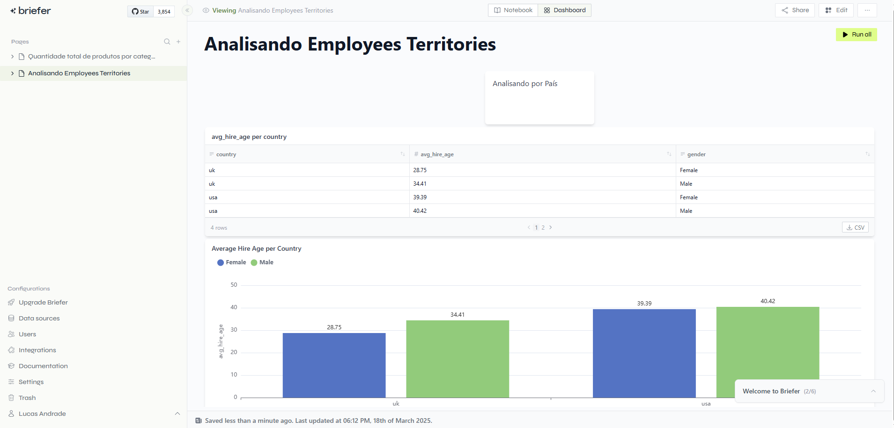

## DBT-Core
Best Practices of DBT-Core: <a href="https://docs.getdbt.com/best-practices/how-we-structure/2-staging">documentação</a>

## O que é o Briefer? 

<p>Ele é uma ferramenta open-source para criar Notebooks e Dashboards.</p>

## Por que usar o Briefer?

- Dashboards e notebooks em um só lugar;
- Colaboração: Notebooks são dificeis de compartilhar, scripts se perdem.
    - Facilita o compartilhamento e colaboração; 
    - Insights podem ser compartilhados com o time de negócio; 
    - Dados sempre atualizados; 

- Agilidade: Ferramentas tradicionais de BI são engessadas e burocráticas.
    - Flexibilidade com o Python, além de inputs e outros recursos; 
    - Possível realizar a sua query de forma rápida e obter uma visualização com poucos cliques; 

- Gratuito, open-source: 
    - Faltou algum conector? Precisa de algum ajuste urgente? Existe essa flexibilidade de implentar [AGPL]; 
    - Comunidade ativa no Slack; 
    - Mesmo na cloud, é cobrado apenas por editor; 

### Como rodar o Briefer no On Premisses?

<p>Importante lembrar que mesmo baixando e utilizando via "pip" é mandatório ter o Docker Desktop instalado na sua máquina.</p>

</img>

### Como ingerir meus dados de um Data Source?

<p>Basta configurar na aba "Data Sources" a sua fonte de dados e utilizar nas suas análises.</p>

</img>

### É possível trabalhar com Filtros e Inputs

</img>

## Ideia de uso 

1) <p>Conectar com o seu Banco de Dados ou Storage e enriquecer os dados utilizando API. Seja para comparar valores e ver se os mesmos estão atualizados no Banco de Dados ou seja para criar novas features e armazenar no Banco de Dados.<p>

2) Criar Dashboards conectando em um Banco de Dados Postgres ou Bucket;

## Como realizar o projeto?
1) Antes de qualquer coisa é necessário criar uma instância no RDS ou qualquer outro Banco de Dados para que o DBT-Core consiga se comunicar e realizar as transformações; 
<a href="https://www.youtube.com/watch?v=_Yzr7yBGWQI&t=236s">habilitando RDS com Local Server.</a>

2) Fazer clone do repositorio;

3) Assim que a instância do RDS estiver configurada, é necessário se conectar ao Banco de Dados e rodar o comando SQL, que está no diretório "initial/northwind.sql";

4) Configurar o DBT-Core. Basta colocar as variáveis de conexão no arquivo ".env" do projeto; 

5) No seu bash executar os comandos: 
``` bash: 
docker-compose build
docker-compose up -d
```

6) Dentro do terminal do DBT-Core, executar o comando:
- Verificar se está tudo certo com a conexão entre Banco e DBT:
``` bash: 
dbt debug
```

7) Rodar os comandos para criação de tabelas e views no Postgres
``` bash: 
dbt seed
dbt run
```

8) Caso queira testar alguma coisa, incluindo os "data tests": 
``` bash: 
dbt test
```

### Relatorios criados com o Briefer utilizando a camada Marts do DBT

</img>

</img>