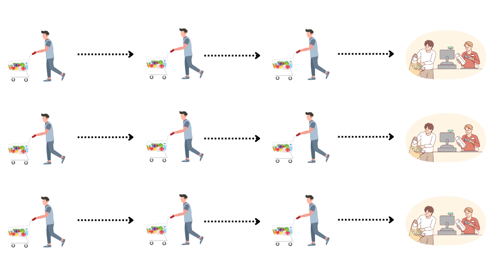
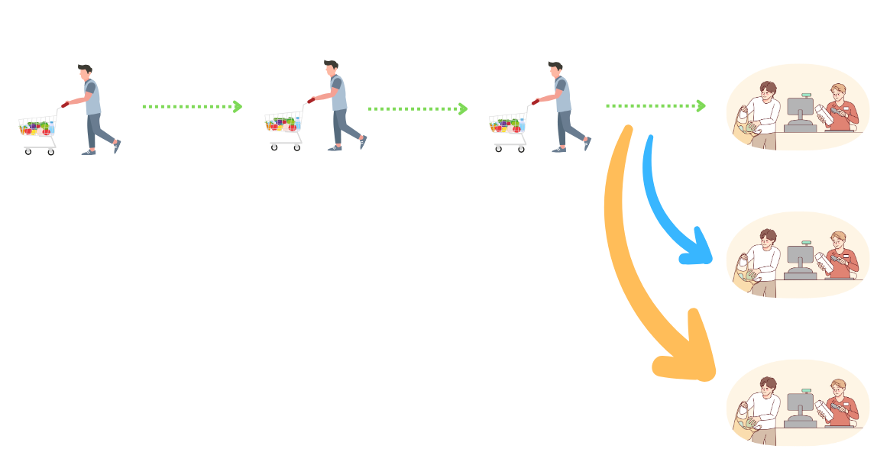
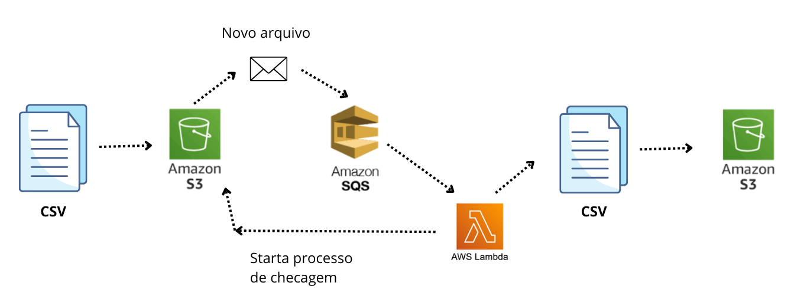

# Stack ou LIFO (Last In // First Out)
O ultimo dado enviado é o primeiro dado a ser enviado. 

# Queue ou FIFO (Fisrt In // First Out)
O primeiro dado enviado é o primeiro dado a ser enviado. 

# Priority Queue ou Árvore
Os itens são enviados de acordo com a ordem de prioridade. 

## Exemplo de filas e qual o melhor cenário? 
1) Diversas filas:

Considerando que todas as filas não tenham limite de quantidade de itens e que os funcionários dos caixas tenham velocidades diferentes de atendimento... 

  

Isso faz com que algumas filas andem mais rápido do que outras, podendo fazer com que alguns clientes esperem mais do que outros. 

2) Única fila

Em um cenário no qual exista apenas uma fila de clientes, mas com diversos caixas de atendimento. Mesmo que exista algum atendente mais rápido do que o outro, o tempo de atendimento médio de espera é menor do que o cenário anterior! 

  

Portanto, esse segundo cenário é o melhor dos casos!

# Exemplo de arquitetura com AWS SQS

 O sistema ou o usuário envia um documento para um bucket/storage, no caso o S3. Na sequência o AWS SQS recebe uma "notificação" sobre o envio do documento e que integrado com o AWS Lambda envia para que algum outro sistema faça algo com as informações, seja persistir os dados, transformar, construir algum Dash, etc. 

  

